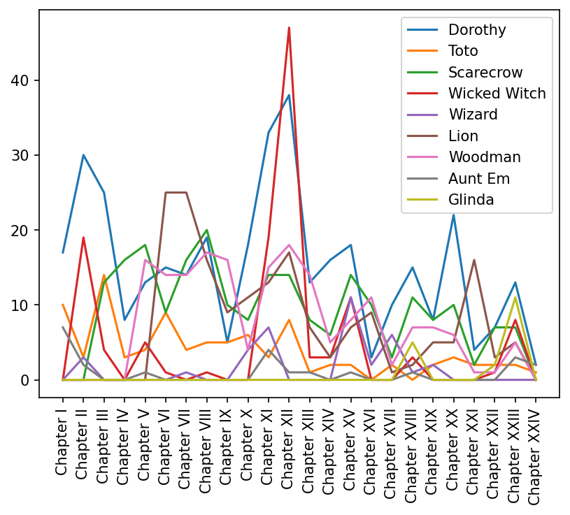
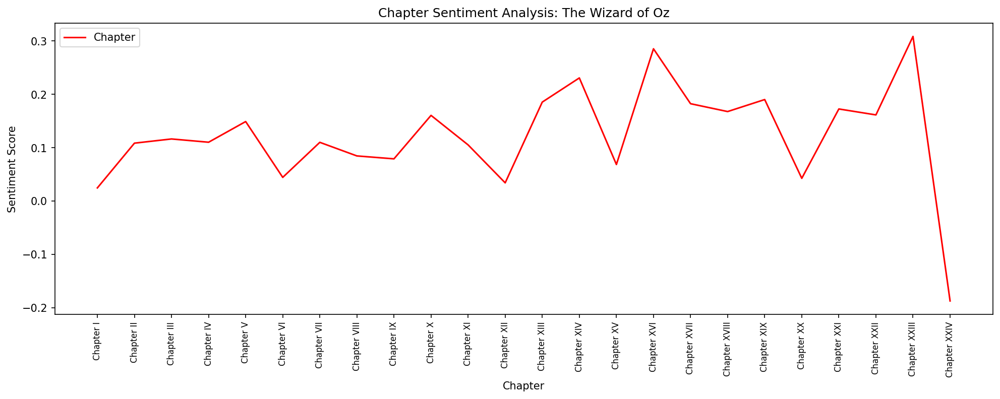
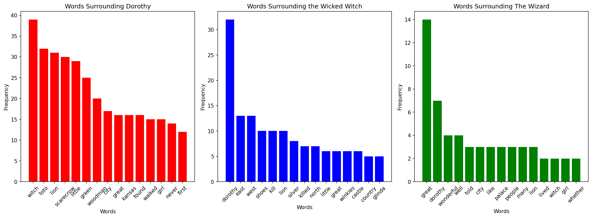

# The Wizard of Oz: An NLP Analysis
## Was L. Frank Baum really a feminist writer?

## Overview
This project analyses the children's book The Wonderful Wizard of Oz 
using Natural Language Processing (NLP) techniques to visualise how 
L. Frank Baum writes about women and power. Using sentiment analysis 
and collocate analysis, it reveals that Baum wasn't as progressive in 
his feminist ideas as he may have believed — female power is framed 
as wicked, while male power is framed as wonderful.

## Key Findings
- The Wicked Witch is surrounded by words like kill, killed, castle 
and country — an ambitious woman who wants to rule, framed as a 
villainous CEO. In Baum's world, female power is wicked.
- The Wizard is surrounded by words like wonderful, great, palace and 
people — a charming, well-liked leader. Male power is wonderful.
- Dorothy is surrounded by male characters who protect her — Toto, 
the Scarecrow, the Lion and the Woodman. She is defined by community 
and companionship rather than individual power.

## Visualisations

### Character Mentions Across Chapters

### Sentiment Analysis Across Chapters

### Words Surrounding Dorothy, the Witch and the Wizard

## Techniques Used
- Sentiment Analysis (TextBlob)
- Collocate Analysis
- Character Mention Tracking

## Libraries
- Python, BeautifulSoup, NLTK, TextBlob, Matplotlib

## Data Source
- Project Gutenberg: The Wonderful Wizard of Oz by L. Frank Baum
